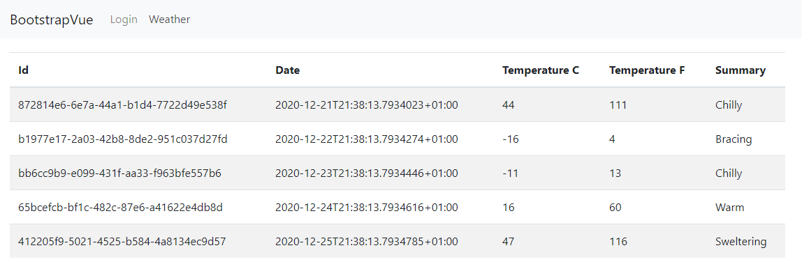
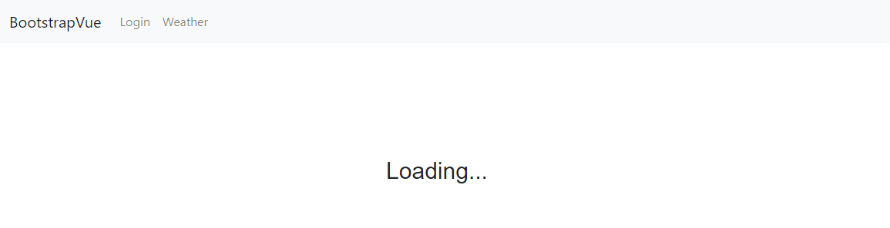
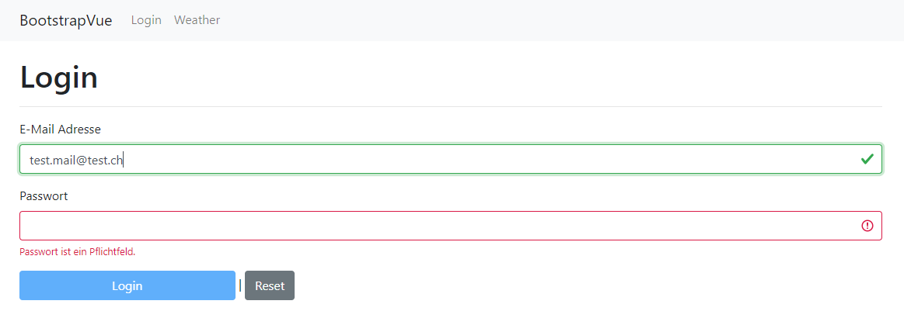

# Nuxt-Forcast
A small standard project to learn nuxt.js/vue.\
It not a stunning result. However, it is a beginning...

## Build with
* Nuxt.js v2.14.6
* NPM v6.14.6
* Typescript
* ASP.NET core API v3.1 (C#)
* Visual Studio Code

## Installation
* Install latest [.Net SDK](https://dotnet.microsoft.com/download)
* Install latest [Node.js](https://nodejs.org/en/)

### Install dependencies
```shell
cd .\src\NuxtForcast\ClientApp
npm install
```

## Usage
Allways build the Nuxt.js project before run
```shell
cd .\src\NuxtForcast\ClientApp
npm run build
```
Run client app
```shell
cd .\src\NuxtForcast\ClientApp
npm start
```
Run backend API\
(Open a new terminal)
```shell
cd .\src\NuxtForcast
dotnet run
```
Call up the application on:\
[http://localhost:3000](http://localhost:3000)

## Preview
### Index site

### Load entries

### Login site


## Author
Levin Joller